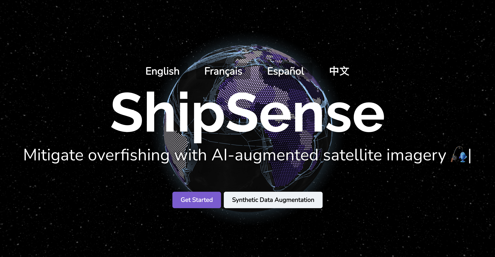

# ShipSense.ai

## Harnessed Stable Diffusion and GANs to generate synthetic ship data based on few training satellite images

## Fine-tuned computer vision model to detect ships in images with 96% accuracy.

## Built data visualization platform with information on overfishing and fishing ships

## Data analysis on dark vessels and hotspots of potentially illicit activity using AIS data.

_Everything in this project was completed during TreeHacks._
_By the way, we've included lots of hidden fishy puns in our writeup!  Comment how many you find!_

## TL; DR
- Illegal overfishing is a massive issue (**>200 billion fish**/year), disrupting global ecosystems and placing hundreds of species at risk of extinction.
- Satellite imagery can detect fishing ships but there's too little positive data to train a good ML model.
- To get synthetic data: we fine-tuned Stable Diffusion on **1/1000ths of the data** of a typical GAN (and 10x training speed) on images of satellite pictures of ships and achieved comparable quality to SOTA. We only used **68** original images!
- We trained a neural network using our real and synthetic data that detected ships with 96% accuracy.
- Built a global map and hotspot dashboard that lets governments view realtime satellite images, analyze suspicious activity hotspots, & take action 
- Our novel Stable Diffusion data augmentation method has potential for many other low-data applications.

Got you hooked? Keep reading!

## Let's get reel...
Did you know global fish supply has **decreased by [49%](https://www.scientificamerican.com/article/ocean-fish-numbers-cut-in-half-since-1970/)** since 1970?

While topics like deforestation and melting ice dominate sustainability headlines, overfishing is a seriously overlooked issue. After thoroughly researching sustainability, we realized that this was an important but under-addressed challenge.

We were shocked to learn that **[90%](https://datatopics.worldbank.org/sdgatlas/archive/2017/SDG-14-life-below-water.html) of fisheries are over-exploited** or collapsing. What's more, around [1 trillion](https://www.forbes.com/sites/michaelpellmanrowland/2017/07/24/seafood-sustainability-facts/?sh=2a46f1794bbf) (1,000,000,000,000) fish are caught yearly.

Hailing from San Diego, Boston, and other cities known for seafood, we were shocked to hear about this problem. Research indicates that despite many verbal commitments to fish sustainably, **one in five fish is illegally caught**. What a load of carp!

### People are shellfish...
Around the world, governments and NGOs have been trying to reel in overfishing, but economic incentives and self-interest mean that many ships continue to exploit resources secretly. It's hard to detect small ships on the world's 140 million square miles of ocean.

## What we're shipping
In short (we won't keep you on the hook): we used custom Stable Diffusion to create realistic synthetic image data of ships and trained a convolutional neural networks (CNNs) to detect and locate ships from satellite imagery. We also built a data visualization platform for stakeholders to monitor overfishing. To enhance this platform, we identified several hotspots of suspicious dark vessel activity by digging into 55,000+ AIS radar records.

While people have tried to build AI models to detect overfishing before, accuracy was poor due to high class imbalance. There are few positive examples of ships on water compared to the infinite negative examples of patches of water without ships. Researchers have used GANs to generate synthetic data for other purposes. However, it takes around 50,000 sample images to train a decent GAN. The largest satellite ship dataset has about 2,000 samples.

We realized that Stable Diffusion (SD), a popular text-to-image AI model, could be repurposed to generate unlimited synthetic image data of ships based on relatively few inputs. We were able to achieve highly realistic synthetic images using only 68 original images.

## How we shipped it
First, we read scientific literature and news articles about overfishing, methods to detect overfishing, and object detection models (and limitations). We identified a specific challenge: class imbalance in satellite imagery.

Next, we split into teams. Molly and Soham worked on the front-end, developing a geographical visualization portal with React. Andrew and Sayak worked on curating satellite imagery from a variety of datasets, performing classical image transformations (rotations, flips, crops), fine-tuning Stable Diffusion models and GANs, and finally using a combo of real and synthetic data to train an R-CNN. Andrew also worked on design, graphics, and AIS data analysis. We explored Leap ML and Runway fine-tuning methods.

## Challenges we tackled
Building Earth visualization portals are always quite challenging, but we could never have predicted the waves we would face. Among animations, rotations, longitude, latitude, country and ocean lines, and the most-feared WebGL, we had a lot to learn. For ocean lines, we made an API call to a submarine transmissions library and recorded features to feed into a JSON. Inspired by the beautiful animated globes of Stripe's and CoPilot's landing pages alike, we challengingly but succeedingly wrote our own.

Additionally, the synthesis between globe to 3D map was difficult, as it required building a new scroll effect compatible with the globe. These challenges, although significant at the time, were ultimately surmountable, as we navigated through their waters unforgivingly. This enabled the series of accomplishments that ensued. 

## Making waves (accomplishments)
Text-to-image models are really cool but have failed to find that many real-world use cases besides art and profile pics. We identified and validated a relevant application for Stable Diffusion that has far-reaching effects for agricultural, industry, medicine, defense, and more.

We also made a sleek and refined web portal to display our results, in just a short amount of time. We also trained a CNN to detect ships using the real and synthetic data that achieved 96% accuracy.

## What we learned
### How to tackle overfishing:
We learned a lot about existing methods to combat overfishing that we didn't know about. We really became more educated on ocean sustainability practices and the pressing nature of the situation. We schooled ourselves on AIS, satellite imagery, dark vessels, and other relevant topics.

### Don't cast a wide net. And don't go overboard.
Originally, we were super ambitious with what we wanted to do, such as implementing Monte Carlo particle tracking algorithms to build probabilistic models of ship trajectories. We realized that we should really focus on a couple of ideas at max because of time constraints.

### Divide and conquer
We also realized that splitting into sub-teams of two to work on specific tasks and being clear about responsibilities made things go very smoothly.

### Geographic data visualization
Building platforms that enable interactions with maps and location data.

## What's on the horizon (implications + next steps)
Our Stable Diffusion data augmentation protocol has implications for few-shot learning of any object for agricultural, defense, medical and other applications. For instance, you could use our method to generate synthetic lung CT-Scan data to train cancer detection models or fine-tune a model to detect a specific diseased fruit not covered by existing general-purpose models.

We plan to create an API that allows anyone to upload a few photos of a specific object. We will build a large synthetic image dataset based off of those objects and train a plug-and-play R-CNN API that performs object location, classification, and counting. 

While general purpose object detection models like YOLO work well for popular and broad categories like "bike" or "dog", they aren't feasible for specific detection purposes. For instance, if you are a farmer trying to use computer vision to detect diseased lychees. Or a medical researcher trying to detect cancerous cells from a microscope slide. Our method allows anyone to obtain an accurate task-specific object detection model. Because one-size-fits-all doesn't cut it.

We're excited to turn the tide with our fin-tech!

_How many fish/ocean-related puns did you find?_
